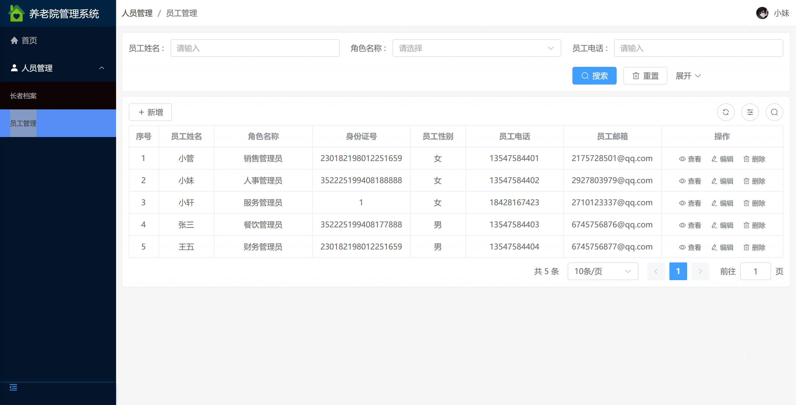
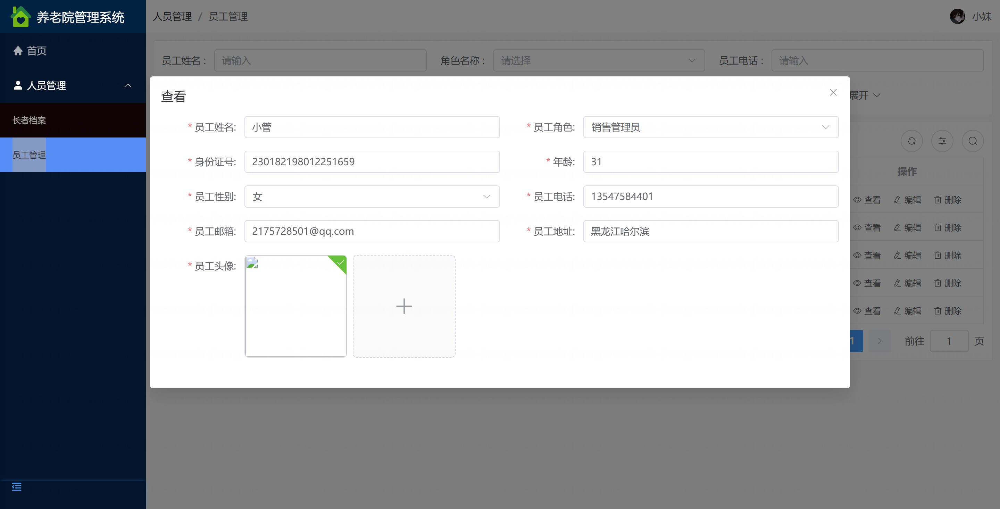
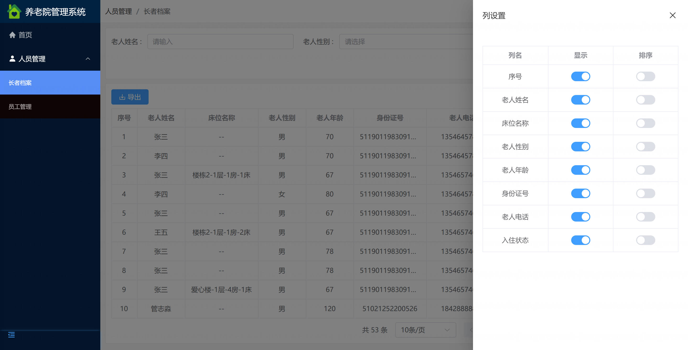
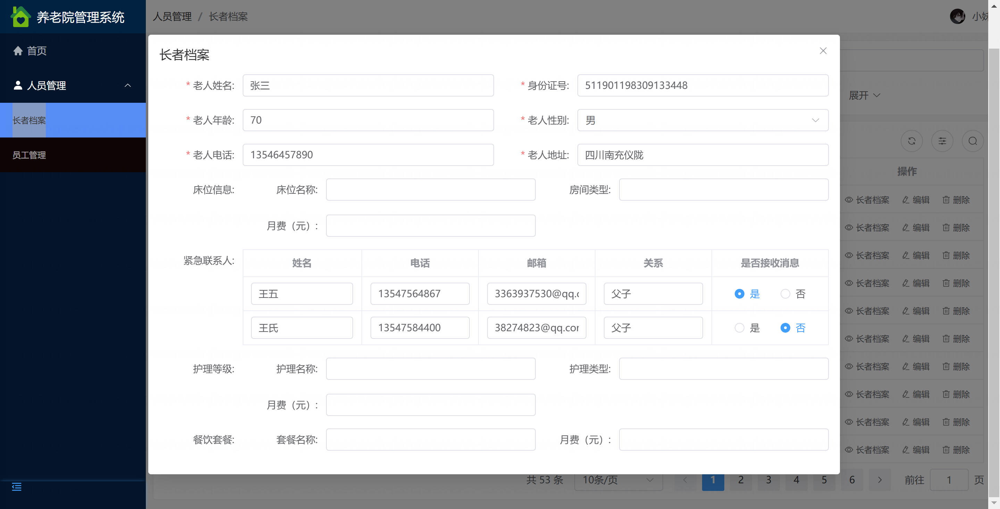
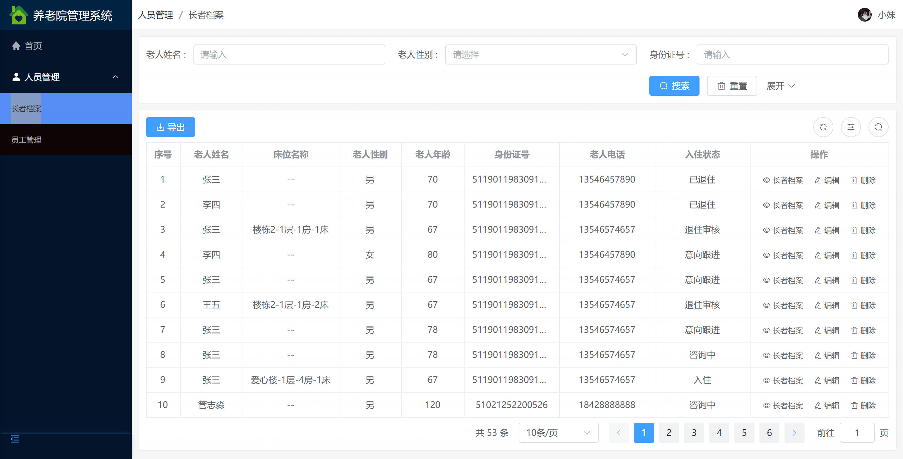
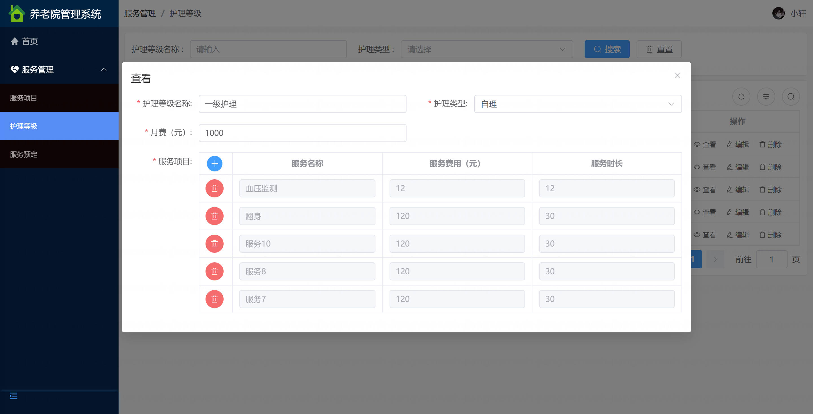
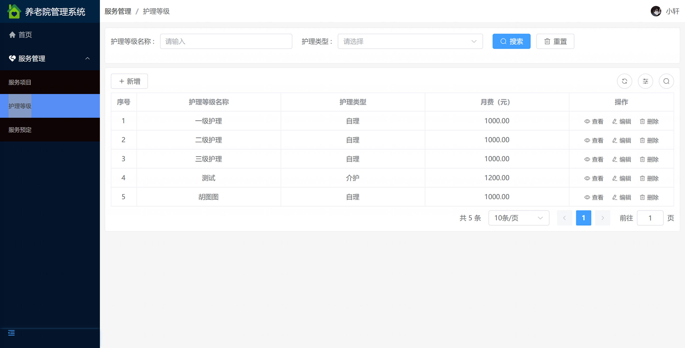
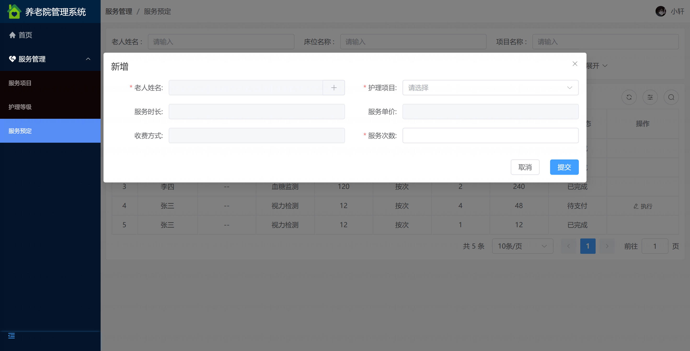
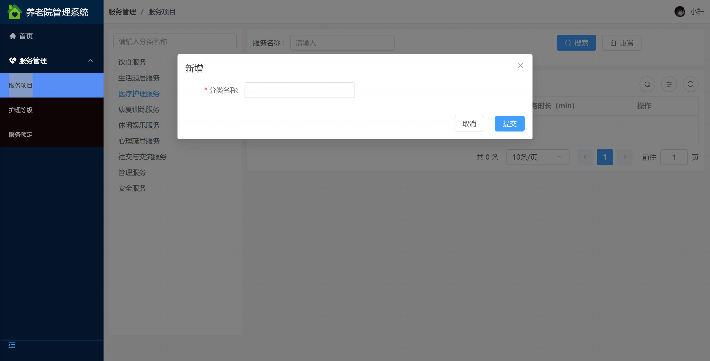

基于Springboot的养老院管理系统（程序+论文）
=

### 完整代码获取地址：从戎源码网 ([https://armycodes.com/](https://armycodes.com/))
### 作者微信：19941326836  QQ：952045282 
### 承接计算机毕业设计、Java毕业设计、Python毕业设计、深度学习、机器学习
### 选题+开题报告+任务书+程序定制+安装调试+论文+答辩ppt 一条龙服务
### 所有选题地址https://github.com/nature924/allProject

一、项目介绍
---
基于 Spring Boot 的养老院管理系统，系统角色为超级管理员、系统管理员、护理人员（或前台/财务），主要功能如下

超级管理员：
基本操作：登录、修改密码、获取个人信息、修改个人信息
权限与用户：用户管理（筛选/新增/查看/删除/获取在线状态/发送消息）、角色管理（新增/删除/查看/筛选/获取列表）、菜单管理（新增/查看/获取列表）
系统运维：日志管理（筛选/获取/查看日志详情）、系统配置、附件管理（上传/查看/删除文件）
基础数据管理：楼栋/楼层/床位/房间管理（新增/查看/删除/修改/筛选）、班组或部门管理
合同与财务：合同管理（新增/修改/查看/删除）、消费记录管理（记录/筛选/查看）
项目级审批：入住/退住审批、各类审批记录查看

系统管理员：
基本操作：登录、修改密码、获取个人信息、修改个人信息
通知与用户：通知管理（获取/发送/查看/删除）、用户管理（筛选/查看/删除/新增）、角色与菜单管理
业务支持：协助合同、消费、报表导出与统计、日志查看与筛选

护理人员 / 前台 / 财务：
基本操作：登录、修改密码、获取个人信息、修改个人信息
老人管理：老人信息管理（新增/查看/修改/筛选）、入住状态管理、老人标签管理、紧急联系人与家属管理
护理与健康：老人健康数据录入与查看（视力/听力/自理等）、沟通记录管理、咨询记录管理
床位与房间：查看床位/房间/楼层/楼栋信息、床位状态管理（空闲/预定/入住/退住审核）
活动与餐饮：活动管理（主题/内容/图片/参与者管理）、餐饮管理（菜品/套餐管理）、活动参与与查询
医疗与药品：药品缴存管理、缴存记录、药品出入相关记录
事故与维修：事故登记（记录/图片）、维修记录管理（发布/查看/确定维修情况）
收费与合同：生成或查看消费记录、合同查看与简单维护
附件与文件：上传/下载/查看文件（如体检单、合同扫描件等）

主要模块（功能维度）
身份认证与权限管理（用户、角色、菜单、权限）
老人管理模块（基本信息、健康数据、标签、紧急联系人、家属）
床位/房间/楼栋/楼层管理模块
活动管理模块（活动发布、参与者管理）
餐饮与菜品管理模块（菜品/套餐、餐饮消费记录）
医疗/药品管理模块（药品缴存、缴存记录）

二、项目技术
---
- 编程语言：Java
- 数据库：MySQL
- 项目架构：B/S架构
- 前端技术：JSP
- 后端技术：Spring、SpringMVC、MyBatis

三、运行环境
---
- 操作系统：Windows、macOS都可以
- JDK版本：JDK1.8以上都可以
- 开发工具：IDEA、Ecplise、Myecplise都可以
- 数据库: MySQL5.7以上都可以
- Tomcat：任意版本都可以
- Maven：任意版本都可以

四、运行截图
---

### 程序截图：

